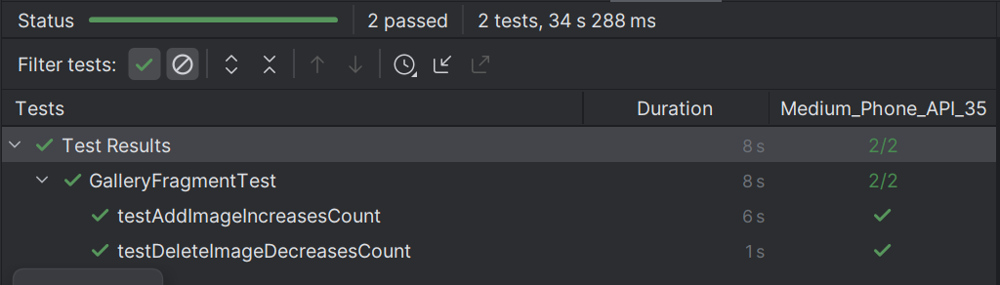
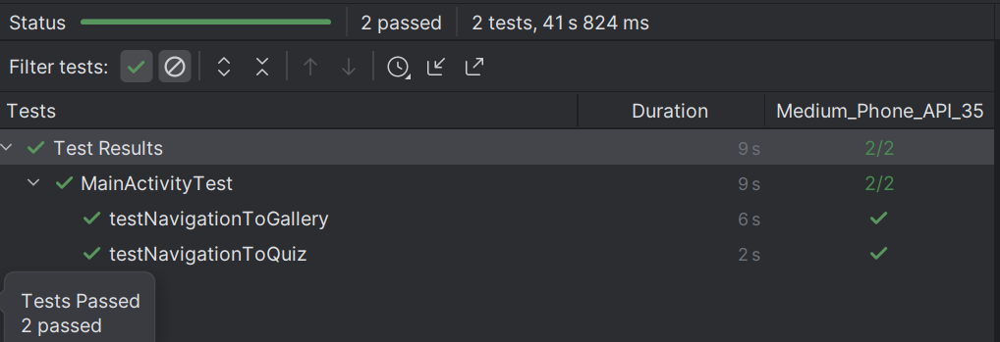
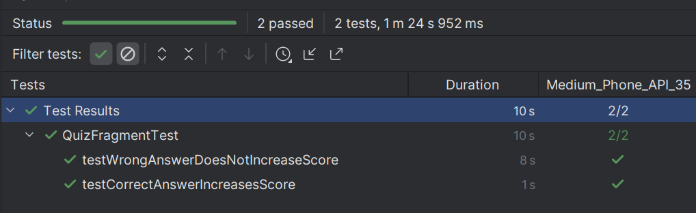

# Quiz App Test Results

## Gallery Management Tests (GalleryFragmentTest)
Tests that verify users can manage images in the gallery.

- `testAddImageIncreasesCount`: Verifies that adding an image increases the gallery count
- `testDeleteImageDecreasesCount`: Verifies that deleting images removes them from the gallery

**Test Results**: All tests passed (2/2) in 8 seconds

## Navigation Tests (MainActivityTest)
Tests that verify navigation between the main screens of the application.

- `testNavigationToGallery`: Verifies clicking "Gallery" button navigates to Gallery fragment
- `testNavigationToQuiz`: Verifies clicking "Quiz" button navigates to Quiz fragment

**Test Results**: All tests passed (2/2) in 9 seconds

## Quiz Functionality Tests (QuizFragmentTest)
Tests that verify the quiz scoring system works correctly.

- `testCorrectAnswerIncreasesScore`: Verifies that selecting the correct answer increases the score
- `testWrongAnswerDoesNotIncreaseScore`: Verifies that selecting a wrong answer does not change the score

**Test Results**: All tests passed (2/2) in 10 seconds

---

